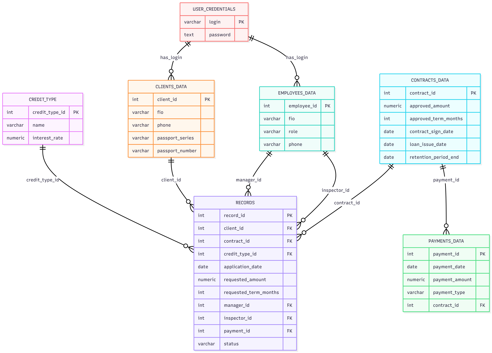

# Bank Credit System

A desktop application for managing credit applications and client data, built with C# and Windows Forms, integrated with PostgreSQL database.

## Table of Contents

- [Overview](#overview)
- [Functionality](#functionality)
- [Technology Stack](#technology-stack)
- [Project Structure](#project-structure)
- [Database Design & Relationships](#database-design--relationships)
- [Database Integration in C#](#database-integration-in-c)
- [SQL Scripts and Data Management](#sql-scripts-and-data-management)
- [Database Objects: Functions, Views, Triggers](#database-objects-functions-views-triggers)

---

## Overview

The Bank Credit System is a comprehensive desktop application designed to manage credit operations for banks. The system provides distinct interfaces for **Clients**, **Managers**, and **Inspectors**, each with specific roles and permissions.

The core of the project lies in its robust **PostgreSQL database design**, featuring multiple interconnected tables with defined relationships, foreign keys, and constraints. The database schema supports the full lifecycle of credit applications, from initial client submission to final approval or rejection.

The application implements role-based access control, where users are authenticated and directed to appropriate forms based on their roles. The system allows for creating new client profiles, submitting credit applications, tracking payments, managing contracts, and assigning inspectors for verification.

Key database components include:
- Client information management
- Credit application tracking
- Contract and payment history
- Employee roles and permissions
- User credentials and security

---

## Functionality

### Client Features:
- **User Authentication:** Secure login with role-based access.
- **Profile Management:** View and update personal information (FIO, phone, passport).
- **Credit Applications:** Submit new credit applications with amount and term.
- **Payment Processing:** Make payments towards existing contracts.
- **Account Overview:** View current balance and total debt.

### Manager Features:
- **Client Application Review:** Accept and process applications submitted by clients.
- **New Client Creation:** Add new clients and create initial credit applications.
- **Inspector Assignment:** Assign inspectors to applications for verification.
- **Record Management:** View all applications assigned to the manager, with color-coded status indicators (red for unassigned, green for assigned to inspector).
- **Application Tracking:** Monitor the status of all applications processed by the manager.

### Inspector Features (Conceptual):
- **Application Verification:** Review assigned applications and approve/reject them.
- **Status Updates:** Update application status based on verification results.

### General Features:
- **Data Integrity:** Enforced through foreign key constraints and database triggers.
- **Dynamic Calculations:** Real-time debt calculation based on payments and approved amounts.
- **Secure Authentication:** Password-protected access with role-based navigation.

---

## Technology Stack

Below are the main technologies, frameworks, and versions used in this project:

- **Programming Language:** C#
- **Framework:** .NET Framework
- **UI Framework:** Windows Forms
- **Database:** PostgreSQL 13+
- **Database Driver:** Npgsql
- **IDE:** Visual Studio
- **Version Control:** Git (for project management)

---

## Project Structure

```
BankCreditSystem/
├── Forms/
│   ├── AuthorizationForm.cs
│   ├── AccountInfoForm.cs
│   ├── ManageForm.cs
│   ├── InspectorForm.cs
│   ├── NewApplicationForm.cs
│   ├── PaymentForm.cs
│   ├── ProfileSettingsForm.cs
│   ├── AcceptClientApplicationForm.cs
│   ├── CreateApplicationForNewClientForm.cs
│   └── MyRecordsForm.cs
├── Globals.cs
├── Program.cs
└── Database/
    └── SQL Scripts
```

---

## Database Design & Relationships

### ER Diagram 


**Explanation of Relationships:**
- `records.client_id` → `clients_data.client_id` (**RESTRICT** — cannot delete client if there are applications)
- `records.contract_id` → `contracts_data.contract_id` (**CASCADE** — deleting a contract deletes related applications)
- `records.credit_type_id` → `credit_type.credit_type_id` (**RESTRICT**)
- `records.manager_id` / `inspector_id` → `employees_data.employee_id` (**SET NULL** — can delete employee, but their ID in applications becomes NULL)
- `payments_data.contract_id` → `contracts_data.contract_id` (**RESTRICT** — cannot delete contract if there are payments)
- `clients_data.login` → `user_credentials.login` (**RESTRICT** — cannot delete credentials if there is a client)
---

## Database Integration in C

The application connects to PostgreSQL using the **Npgsql** library. Database connection is managed globally through the `Globals.cs` class:

```csharp
namespace tr
{
    public class Globals
    {
        public static string connectionString = "Host=localhost;Port=5432;Username=postgres;Password=qwert013579;Database=BD1";
        public static NpgsqlConnection connection = null;
    }
}
```

**The connection is initialized in Program.cs:**

```
static void Main()
{
    try
    {
        connection = new NpgsqlConnection(connectionString);
        connection.Open();

        Application.EnableVisualStyles();
        Application.SetCompatibleTextRenderingDefault(false);
        Application.Run(new AuthorizationForm());
    }
    catch (Exception ex)
    {
        MessageBox.Show($"Database connection error: {ex.Message}!", "Error!", MessageBoxButtons.OK, MessageBoxIcon.Error);
    }
}
```
**SQL Integration Example**

**Here's how SQL queries are integrated into C# forms:**

```
private void LoadClientData()
{
    try
    {
        string query = @"
            SELECT fio, phone, passport_series, passport_number
            FROM clients_data
            WHERE client_id = @client_id;";

        using (var command = new NpgsqlCommand(query, connection))
        {
            command.Parameters.AddWithValue("@client_id", _clientId);
            using (var reader = command.ExecuteReader())
            {
                if (reader.Read())
                {
                    string fullName = reader["fio"].ToString();
                    string phone = reader["phone"].ToString();
                    // Process data...
                }
            }
        }
    }
    catch (Exception ex)
    {
        MessageBox.Show($"Error loading client  {ex.Message}", "Error!", MessageBoxButtons.OK, MessageBoxIcon.Error);
    }
}
```
---

## SQL Scripts and Data Management

```
CREATE TABLE credit_type (
    credit_type_id SERIAL PRIMARY KEY,
    name VARCHAR(50) NOT NULL UNIQUE,
    interest_rate NUMERIC(5,2) NOT NULL
);

CREATE TABLE employees_data (
    employee_id SERIAL PRIMARY KEY,
    fio VARCHAR(200) NOT NULL,
    role VARCHAR(50) NOT NULL CHECK (role IN ('manager','inspector','other')),
    phone VARCHAR(30)
);

CREATE TABLE clients_data (
    client_id SERIAL PRIMARY KEY,
    fio VARCHAR(200) NOT NULL,
    phone VARCHAR(30),
    passport_series VARCHAR(10),
    passport_number VARCHAR(20)
);

CREATE TABLE contracts_data (
    contract_id SERIAL PRIMARY KEY,
    approved_amount NUMERIC(14,2),
    approved_term_months INT,
    contract_sign_date DATE,
    loan_issue_date DATE,
    retention_period_end DATE
);

CREATE TABLE payments_data (
    payment_id SERIAL PRIMARY KEY,
    payment_date DATE NOT NULL DEFAULT CURRENT_DATE,
    payment_amount NUMERIC(14,2) NOT NULL,
    payment_type VARCHAR(50)
);

CREATE TABLE records (
    record_id SERIAL PRIMARY KEY,
    client_id INT NOT NULL REFERENCES clients_data(client_id) ON DELETE RESTRICT,
    contract_id INT NOT NULL REFERENCES contracts_data(contract_id) ON DELETE CASCADE,
    credit_type_id INT NOT NULL REFERENCES credit_type(credit_type_id) ON DELETE RESTRICT,
    application_date DATE DEFAULT CURRENT_DATE,
    requested_amount NUMERIC(14,2),
    requested_term_months INT,
    manager_id INT REFERENCES employees_data(employee_id) ON DELETE SET NULL,
    inspector_id INT REFERENCES employees_data(employee_id) ON DELETE SET NULL,
    payment_id INT NOT NULL REFERENCES payments_data(payment_id) ON DELETE RESTRICT,
    status VARCHAR(30) NOT NULL DEFAULT 'на проверке'
);

CREATE TABLE user_credentials (
    login VARCHAR(50) PRIMARY KEY,
    password TEXT NOT NULL
);
```
---

## Database Objects: Functions, Views, Triggers

**Scalar Function**

```
CREATE OR REPLACE FUNCTION get_manager_records(manager_id_param INT)
RETURNS TABLE (
    record_id INT,
    client_id INT,
    fio TEXT,
    phone TEXT,
    requested_amount NUMERIC,
    requested_term_months INT,
    application_date DATE,
    status VARCHAR
) AS $$
BEGIN
    RETURN QUERY
    SELECT
        r.record_id,
        r.client_id,
        c.fio,
        c.phone,
        r.requested_amount,
        r.requested_term_months,
        r.application_date,
        r.status
    FROM records r
    JOIN clients_data c ON r.client_id = c.client_id
    WHERE r.manager_id = manager_id_param
    ORDER BY r.application_date DESC;
END;
$$ LANGUAGE plpgsql;
```

**View**

**Shows active contracts with debt information:**
```
CREATE OR REPLACE VIEW active_contracts_view AS
SELECT
    r.client_id,
    c.contract_id,
    cl.fio AS client_fio,
    c.approved_amount,
    COALESCE(SUM(p.payment_amount), 0) AS total_paid,
    (c.approved_amount - COALESCE(SUM(p.payment_amount), 0)) AS remaining_debt
FROM records r
JOIN contracts_data c ON r.contract_id = c.contract_id
JOIN clients_data cl ON r.client_id = cl.client_id
LEFT JOIN payments_data p ON c.contract_id = p.contract_id
WHERE r.status = 'одобрено'
GROUP BY r.client_id, c.contract_id, cl.fio, c.approved_amount;
```

**Trigger**

**Automatically updates status when inspector is assigned:**

```
CREATE OR REPLACE FUNCTION update_status_on_inspector_assign()
RETURNS TRIGGER AS $$
BEGIN
    IF NEW.inspector_id IS NOT NULL AND OLD.inspector_id IS NULL THEN
        NEW.status := 'на проверке';
    END IF;
    RETURN NEW;
END;
$$ LANGUAGE plpgsql;

CREATE TRIGGER trigger_on_inspector_assign
    BEFORE UPDATE OF inspector_id ON records
    FOR EACH ROW
    EXECUTE FUNCTION update_status_on_inspector_assign();
```
This trigger ensures data consistency by automatically updating the application status when an inspector is assigned, demonstrating advanced PostgreSQL functionality and automated business logic.
